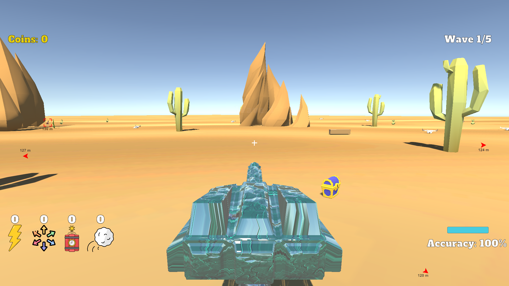

# Glass Cannon

Group Members:
Santiago Garcia, Joel Shaw, Johan Sarmiento, Kyle Olson

# Gameplay

# Concept
- You play through 3 progressively more diffcult levels as a glass cannon protecting a treasure chest. If you let an enemy touch the treasure chest then you will explode and restart the level.
- With each level completed unlocks a new mechanic for the turret!
- You have access to an item shop where you can buy powerups with the coins you earn by hitting the enemies.
- There are 3 types of enemies that will intelligently try to avoid getting hit.
